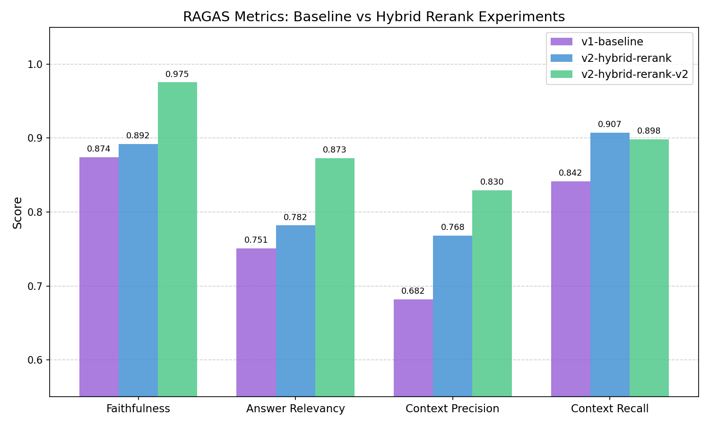
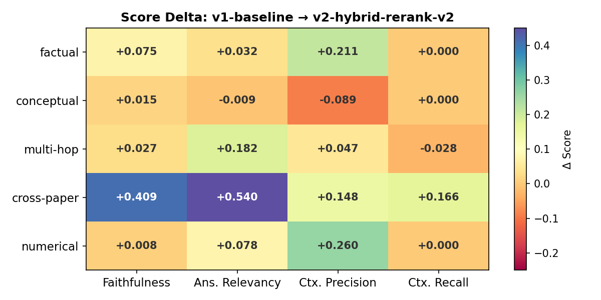

# ArXiv ML Research Assistant

[](https://github.com/anime-sh16/research-rag/actions/workflows/ci.yml)

An end-to-end production-grade RAG system for querying ArXiv ML research papers with natural language. Ask a question, get a grounded answer with source citations — retrieved from a corpus of curated ML papers spanning LLMs, diffusion models, RL alignment, vision transformers, and more.

**Current Stage:** v2 — Hybrid Search + Reranking + Gemini 3 Flash

---

## Aim

Build a RAG system over ArXiv ML research using **measurement-driven iteration**: every component exists because evaluation revealed a failure. Every change is validated by running the same fixed 41-question eval set.

---

## How It Works

```
User Question
     │
     ▼
[Retriever] ──── Hybrid search: Dense (Gemini embeddings) + Sparse (BM25)
     │                  Fused via Reciprocal Rank Fusion (RRF)
     ▼
[Reranker]  ──── Jina Reranker v3 — selects top-5 from fused candidates
     │
     ▼
[Generator] ──── Gemini 3 Flash Preview
     │                  Grounded by retrieved context only
     ▼
Answer + Sources (paper title, authors, arxiv ID, score)
```

---

## Data

**Source:** ArXiv API (free, structured, no scraping required)

**Topics (8 query areas):**
- Large language models & NLP transformers
- Retrieval-augmented generation & knowledge systems
- Diffusion & generative models
- Fine-tuning & instruction tuning
- Reinforcement learning & alignment (RLHF)
- Vision transformers & multimodal learning
- LLM agents, planning, tool use
- Inference optimization (quantization, pruning)

**Filtering:** Papers must belong to an allowed category allowlist (`cs.LG`, `cs.CL`, `cs.AI`, `cs.CV`, `cs.IR`, `cs.NE`, `cs.MA`, `stat.ML`) — off-domain papers are rejected at fetch time.

**Volume:** Up to 70 papers per topic, deduplicated by ArXiv ID. PDFs are downloaded selectively and text is extracted with PyMuPDF (ligature normalization, hyphenation fixing, reference section removal).

---

## Ingestion Pipeline

**Location:** `src/ingestion/`

### 1. ArXiv Client (`arxiv_client.py`)
Fetches paper metadata, filters by category, deduplicates, then downloads PDFs for accepted papers. Respects ArXiv rate limits with 5s delays and 3 retries with exponential backoff.

### 2. Chunking (`chunker.py`)
- **Method:** `RecursiveCharacterTextSplitter` (LangChain)
- **Tokenizer:** Tiktoken `o200k_base` for accurate token counting
- **Chunk size:** 512 tokens | **Overlap:** 64 tokens
- **Metadata per chunk:** `paper_id`, `title`, `authors`, `category`, `publication_date`, `source`

### 3. Embeddings & Vector Store (`vector_store.py`)
- **Model:** `gemini-embedding-001` (768-dim output, cosine distance)
- **Task types:** `RETRIEVAL_DOCUMENT` at ingest, `RETRIEVAL_QUERY` at search time
- **Sparse index:** BM25 (Qdrant native) built alongside dense index
- **Database:** Qdrant Cloud (collection: `arxiv_paper_v0.5`)
- **Deduplication:** UUID5-based chunk IDs prevent re-embedding on re-runs
- **Rate limiting:** 100-chunk batches with 4s inter-batch sleep + exponential backoff on 429s

### 4. Ingestion Orchestrator (`pipeline.py`)
Runs multi-topic fetching with progress tracking. Saves output as `chunks_<timestamp>.jsonl` and `summary_<timestamp>.json`.

---

## Retrieval

**Location:** `src/retrieval/retriever.py`

**Hybrid search** — dense + sparse fused via RRF:
1. Dense: cosine similarity over Gemini embeddings
2. Sparse: BM25 lexical matching (Qdrant native)
3. Fusion: Reciprocal Rank Fusion merges both ranked lists
4. Reranking: Jina Reranker v3 selects final top-5

- Query embeddings are cached (MD5-keyed JSONL) to avoid redundant API calls
- Exponential backoff on embedding rate limits
- LangSmith proxy metrics logged per query: `retrieval_avg_score`, `retrieval_score_spread`, `source_diversity`

---

## Generation Pipeline

**Location:** `src/generation/chain.py`

- **Model:** Gemini 3 Flash Preview (`temperature=0.1`, `thinking_level=low`)
- **Prompt:** System instruction constrains answers to retrieved context only. Explicitly instructs the model to answer directly without preamble.
- **Tracing:** Full prompt, token usage, and cited paper IDs logged to LangSmith
- **Retry logic:** Up to 5 attempts with exponential backoff on 429/503 errors

---

## FastAPI

**Location:** `src/api/main.py`

### `POST /query`

**Request:**
```json
{ "question": "What training objective does InstructGPT use?" }
```

**Response:**
```json
{
  "answer": "InstructGPT uses RLHF with a KL penalty...",
  "sources": [
    {
      "title": "Training language models to follow instructions...",
      "authors": ["Ouyang, Long", "..."],
      "paper_id": "2203.02155",
      "chunk_index": 3,
      "score": 0.84
    }
  ]
}
```

Run locally:
```bash
uv run uvicorn src.api.main:app --reload
```

---

## Evaluation

**Location:** `src/evaluation/` | `./evaluation/`

### Evaluation Set
41 hand-curated questions with ground truth answers, covering:
- **Types:** Factual, conceptual, multi-hop, numerical, cross-paper
- **Subtypes:** Method-detail, metric, hyperparameter, formula, throughput, architecture, comparison, tradeoff, limitation

The eval set is **fixed and immutable** — all experiments run against the same 41 questions.

### RAGAS Metrics
| Metric | What it measures |
|---|---|
| **Faithfulness** | Does the answer hallucinate facts not in the retrieved context? |
| **Answer Relevancy** | Is the answer relevant to the question asked? |
| **Context Precision** | Are retrieved chunks actually relevant to the ground truth? |
| **Context Recall** | Does retrieval capture all context needed to answer? |

---

## Results

### Aggregate Scores Across Experiments

| Metric | v1-baseline | v2-hybrid-rerank | v2-hybrid-rerank-v2 |
|---|---|---|---|
| **Faithfulness** | 0.8742 | 0.8918 | **0.9753** |
| **Answer Relevancy** | 0.7509 | 0.7818 | **0.8726** |
| **Context Precision** | 0.6818 | 0.7680 | **0.8295** |
| **Context Recall** | 0.8415 | 0.9071 | **0.8984** |
| **"Don't know" answers** | 8 | 5 | **3** |



---

### v1-baseline — Dense Retrieval + Gemini 2.5 Flash Lite (2026-03-11)

**Key observations:**
- Faithfulness strong (0.87) — model correctly refuses to hallucinate when context is missing
- Context Precision (0.68) weakest — relevant chunks buried at positions 3–5, dense ranking cannot distinguish relevance
- ~8 "don't know" responses — all retrieval failures, not generation failures
- Cross-paper questions catastrophic (5/6 DK) — dense-only retrieval locks onto one paper's cluster

**Root causes identified:** No lexical retrieval signal, poor chunk ranking, source concentration without diversity

Full analysis: [v1-baseline-analysis.md](evaluation/results/v1-baseline/v1-baseline-analysis.md)

---

### v2-hybrid-rerank — Hybrid Search + Jina Reranker v2 (2026-03-12)

**Changes:** Added BM25 sparse retrieval + RRF fusion + Jina reranker-v2-base-multilingual

**Key results:**
- Context Precision +0.09 (largest gain) — reranker promotes relevant chunks to top position
- Context Recall +0.07 — hybrid search surfaces papers missed by dense-only
- 4 previously DK questions resolved; 1 new regression (q_025)
- Cross-paper DK: 5 → 3. BM25 resolved exact-term cross-paper failures (q_028, q_031)

**Remaining failures:** 2 retrieval diversity gaps, 1 generation failure with improved retrieval, 1 ingestion failure (table data)

Full analysis: [V2-HYBRID-RERANK-ANALYSIS.md](evaluation/results/v2-hybrid-rerank/V2-HYBRID-RERANK-ANALYSIS.md)

---

### v2-hybrid-rerank-v2 — Upgraded LLM + Jina Reranker v3 (2026-03-14)

**Changes:** Gemini 2.5 Flash Lite → Gemini 3 Flash Preview | Jina reranker-v2 → Jina reranker-v3

**Key results:**
- Faithfulness: 0.8918 → **0.9753** (+0.08)
- Answer Relevancy: 0.7818 → **0.8726** (+0.09)
- DK count: 5 → **2** (q_025 regression fixed, q_030 resolved)
- Cross-paper category transformed: faithfulness 0.58 → **0.97**, answer relevancy 0.56 → **0.93**

**Why it worked:** `gemini-3-flash-preview` synthesizes across heterogeneous chunks that the previous model refused to process — directly resolving the generation-layer failures identified in v2.1.

**Remaining failures:** 2 retrieval diversity gaps (q_029, q_032 — AWQ/QServe not surfaced), 2 multi-hop recall gaps (q_033, q_034), 1 ingestion failure (q_039 — table data)

Full analysis: [V2-HYBRID-RERANK-ANALYSIS-v2.md](evaluation/results/v2-hybrid-rerank-v2/V2-HYBRID-RERANK-ANALYSIS-v2.md)

### Score Delta by Question Type (v1 → v2.2)



Cross-paper questions saw the largest gains across faithfulness and answer relevancy. Factual questions now approach ceiling performance. Multi-hop recall shows a slight dip due to persistent second-hop retrieval gaps.

---

## Project Structure

```
research-rag/
├── src/
│   ├── api/
│   │   └── main.py               # FastAPI app + pipeline orchestration
│   ├── config/
│   │   └── config.py             # Pydantic settings (loaded from .env)
│   ├── ingestion/
│   │   ├── arxiv_client.py       # ArXiv API fetch + PDF extraction
│   │   ├── chunker.py            # Recursive chunking + metadata
│   │   ├── pipeline.py           # Multi-topic ingestion orchestrator
│   │   └── vector_store.py       # Gemini embeddings + Qdrant upsert
│   ├── retrieval/
│   │   └── retriever.py          # Hybrid search (dense + BM25) + RRF + reranking
│   ├── generation/
│   │   └── chain.py              # Gemini generation + LangSmith tracing
│   └── evaluation/
│       ├── ragas_runner.py       # RAGAS evaluation + LangSmith experiments
│       └── dataset_upload.py     # Upload evalset to LangSmith
├── evaluation/
│   ├── evalset.json              # 41 questions + ground truth (immutable)
│   └── results/
│       ├── v1-baseline.json
│       ├── v2-hybrid-rerank/
│       └── v2-hybrid-rerank-v2/
├── tests/                        # Unit + integration tests (mirrors src/)
├── scripts/                      # Dev utilities (verify connections, smoke tests)
├── .github/workflows/ci.yml      # Lint + format + test on every push
├── pyproject.toml                # Single config: uv, ruff, pytest, hatchling
└── .env.template                 # Copy to .env and fill in API keys
```

---

## Tech Stack

| Layer | Technology |
|---|---|
| **Embeddings** | Google Gemini (`gemini-embedding-001`, 768d) |
| **Sparse Search** | BM25 via Qdrant native |
| **Reranker** | Jina Reranker v3 |
| **LLM** | Google Gemini 3 Flash Preview |
| **Vector DB** | Qdrant Cloud |
| **PDF Extraction** | PyMuPDF |
| **Chunking** | LangChain `RecursiveCharacterTextSplitter` + Tiktoken |
| **API** | FastAPI + Uvicorn |
| **Evaluation** | RAGAS |
| **Tracing** | LangSmith |
| **Config** | Pydantic Settings |
| **Retry Logic** | Tenacity |
| **Linting/Formatting** | Ruff |
| **Testing** | Pytest |
| **Packaging** | uv + hatchling |

---

## Setup

**Prerequisites:** Python 3.12, [`uv`](https://docs.astral.sh/uv/)

```bash
git clone https://github.com/anime-sh16/research-rag.git
cd research-rag

# Install dependencies and project in editable mode
uv sync --all-groups

# Copy environment template and fill in your API keys
cp .env.template .env
```

### Required API Keys

| Variable | Where to get it |
|---|---|
| `GOOGLE_API_KEY` | [Google AI Studio](https://aistudio.google.com) |
| `QDRANT_URL` | Qdrant Cloud console |
| `QDRANT_API_KEY` | Qdrant Cloud console |
| `JINA_API_KEY` | Jina AI dashboard |
| `LANGSMITH_API_KEY` | LangSmith settings |
| `LANGSMITH_PROJECT` | LangSmith project name |
| `LANGSMITH_TRACING` | `true` to enable tracing |
| `LANGSMITH_ENDPOINT` | `https://api.smith.langchain.com` |

### Verify setup

```bash
uv run scripts/verify_connections.py
```

---

## Running

```bash
# Start the API server
uv run uvicorn src.api.main:app --reload

# Run evaluation against the full eval set
uv run python -m src.evaluation.ragas_runner --experiment <name>

# Run tests
uv run pytest

# Lint / Format
uv run ruff check .
uv run ruff format .
```

---

## CI

Every push to `main` and every pull request runs:

1. `ruff check` — linting
2. `ruff format --check` — formatting
3. `pytest` — full test suite

---

## Next Steps

| Priority | Task | Addresses |
|---|---|---|
| 1 | **Retrieval diversity (MMR / source-aware reranking)** | q_029, q_032 — query terms overwhelm one source |
| 2 | **Multi-hop retrieval / query decomposition** | q_033, q_034 — second hop not retrieved |
| 3 | **Table-aware PDF ingestion** | q_039 — only persistent full DK |
| 4 | **RAGAS regression gate in CI** | Block deploys if scores drop below stored baseline |
