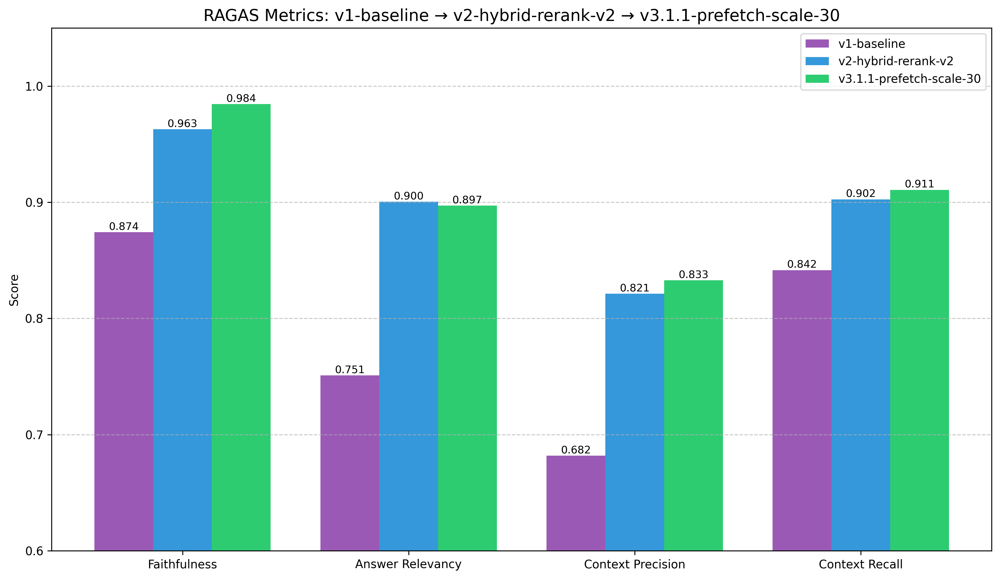
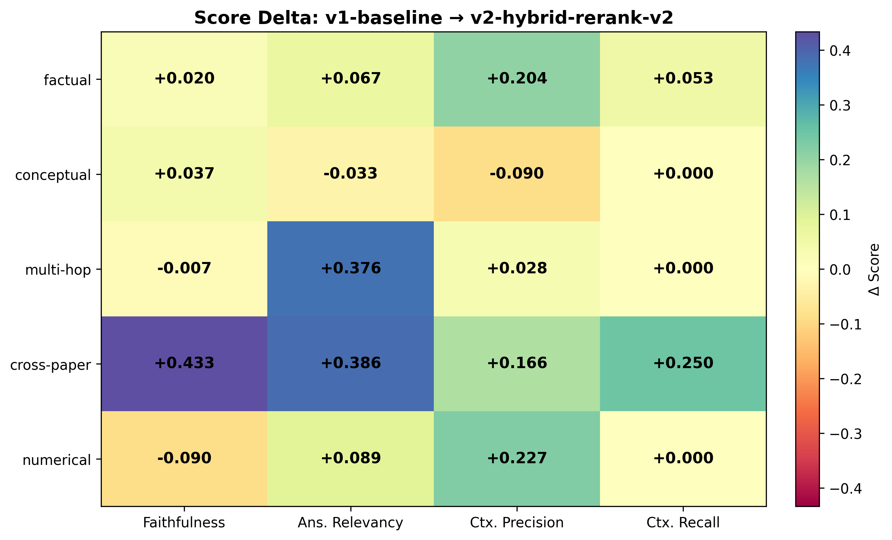
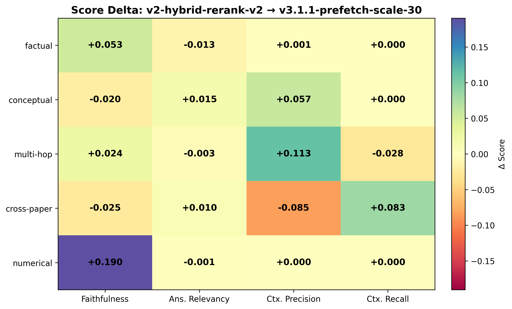

# ArXiv ML Research Assistant

[](https://github.com/anime-sh16/research-rag/actions/workflows/ci.yml)

An end-to-end production-grade RAG system for querying ArXiv ML research papers with natural language. Ask a question, get a grounded answer with source citations — retrieved from a corpus of curated ML papers spanning LLMs, diffusion models, RL alignment, vision transformers, and more.

**Current Stage:** v3.1.1 — Query Decomp + BM25 Expansion + Prefetch Scale 30 | Best composite: **0.9062** | **Live at [research-rag-animesh.duckdns.org](https://research-rag-animesh.duckdns.org)**

---

## Live Demo

**URL:** [https://research-rag-animesh.duckdns.org](https://research-rag-animesh.duckdns.org)

Ask any natural language question about ML research — RL alignment, LLM inference, diffusion models, vision transformers, and more.

**API:** `POST https://research-rag-animesh.duckdns.org/api/query`
```bash
curl -X POST https://research-rag-animesh.duckdns.org/api/query \
  -H "Content-Type: application/json" \
  -d '{"question": "What training objective does InstructGPT use?"}'
```

---

## Aim

Build a RAG system over ArXiv ML research using **measurement-driven iteration**: every component exists because evaluation revealed a failure. Every change is validated by running the same fixed 41-question eval set.

---

## How It Works

```
User Question
     │
     ▼
[Query Analysis] ─ LLM decomposes into sub-queries (one per topic/entity)
     │                 + BM25 expansion terms (domain synonyms/abbreviations)
     ▼
[Retriever] ────── Per sub-query hybrid search: Dense (Gemini embeddings)
     │                 + Sparse (BM25 w/ expansion), fused via RRF (prefetch pool 30)
     │                 Candidates merged + deduplicated across sub-queries
     ▼
[Reranker]  ────── Jina Reranker v3 — scores the merged pool against the
     │                 original question, selects top-5
     ▼
[Generator] ────── Gemini 3 Flash Preview
     │                 Grounded by retrieved context only
     ▼
Answer + Sources (paper title, authors, arxiv ID, score)
```

---

## Data

**Source:** ArXiv API (free, structured, no scraping required)

**Topics (8 query areas):**
- Large language models & NLP transformers
- Retrieval-augmented generation & knowledge systems
- Diffusion & generative models
- Fine-tuning & instruction tuning
- Reinforcement learning & alignment (RLHF)
- Vision transformers & multimodal learning
- LLM agents, planning, tool use
- Inference optimization (quantization, pruning)

**Filtering:** Papers must belong to an allowed category allowlist (`cs.LG`, `cs.CL`, `cs.AI`, `cs.CV`, `cs.IR`, `cs.NE`, `cs.MA`, `stat.ML`) — off-domain papers are rejected at fetch time.

**Volume:** Up to 70 papers per topic, deduplicated by ArXiv ID. PDFs are downloaded selectively and text is extracted with PyMuPDF (ligature normalization, hyphenation fixing, reference section removal).

---

## Ingestion Pipeline

**Location:** `src/ingestion/`

### 1. ArXiv Client (`arxiv_client.py`)
Fetches paper metadata, filters by category, deduplicates, then downloads PDFs for accepted papers. Respects ArXiv rate limits with 5s delays and 3 retries with exponential backoff.

### 2. Chunking (`chunker.py`)
- **Method:** `RecursiveCharacterTextSplitter` (LangChain)
- **Tokenizer:** Tiktoken `o200k_base` for accurate token counting
- **Chunk size:** 512 tokens | **Overlap:** 64 tokens
- **Metadata per chunk:** `paper_id`, `title`, `authors`, `category`, `publication_date`, `source`

### 3. Embeddings & Vector Store (`vector_store.py`)
- **Model:** `gemini-embedding-001` (768-dim output, cosine distance)
- **Task types:** `RETRIEVAL_DOCUMENT` at ingest, `RETRIEVAL_QUERY` at search time
- **Sparse index:** BM25 (Qdrant native) built alongside dense index
- **Database:** Qdrant Cloud (collection: `arxiv_paper_v1_hybrid`)
- **Deduplication:** UUID5-based chunk IDs prevent re-embedding on re-runs
- **Rate limiting:** 100-chunk batches with 4s inter-batch sleep + exponential backoff on 429s

### 4. Ingestion Orchestrator (`pipeline.py`)
Runs multi-topic fetching with progress tracking. Saves output as `chunks_<timestamp>.jsonl` and `summary_<timestamp>.json`.

---

## Retrieval

**Location:** `src/retrieval/retriever.py`

A five-step pipeline. Query decomposition (steps 1, 3) is the core v3 addition; the hybrid-search core (step 2) dates to v2.

1. **Query analysis** — an LLM decomposes the question into one sub-query per distinct topic/entity (single-topic questions yield exactly one), and extracts 3–8 BM25 expansion terms (domain synonyms, abbreviations, alternative names) per sub-query. Falls back to the raw query if extraction fails.
2. **Per-sub-query hybrid search** — for each sub-query: dense cosine similarity over Gemini embeddings + sparse BM25 (query augmented with its expansion terms), fused via Reciprocal Rank Fusion (RRF). The prefetch pool (30) is split evenly across sub-queries so the total candidate count stays bounded.
3. **Merge + deduplicate** — candidate lists from all sub-queries are unioned and deduplicated, keeping the highest score per chunk.
4. **Reranking** — Jina Reranker v3 scores the merged pool against the **original** question (not the sub-queries) and selects the final top-5.

- Query embeddings are cached (MD5-keyed JSONL) to avoid redundant API calls
- Exponential backoff on embedding rate limits
- LangSmith proxy metrics logged per query: `retrieval_avg_score`, `retrieval_score_spread`, `source_diversity`

---

## Generation Pipeline

**Location:** `src/generation/chain.py`

- **Model:** Gemini 3 Flash Preview (`temperature=0.1`, `thinking_level=low`)
- **Prompt:** System instruction constrains answers to retrieved context only. Explicitly instructs the model to answer directly without preamble.
- **Tracing:** Full prompt, token usage, and cited paper IDs logged to LangSmith
- **Retry logic:** Up to 5 attempts with exponential backoff on 429/503 errors

---

## FastAPI

**Location:** `src/api/main.py`

The app defines two routes at its root: `POST /query` and `GET /health`. In production these sit behind Caddy, which serves the Streamlit UI at `/` and reverse-proxies `/api/*` to the API with the `/api` prefix stripped. So the same endpoint is:

| | Base URL | Query endpoint | Health |
|---|---|---|---|
| **Production** (behind Caddy) | `https://research-rag-animesh.duckdns.org` | `POST /api/query` | `GET /api/health` |
| **Local** (uvicorn direct) | `http://localhost:8000` | `POST /query` | `GET /health` |

### `POST /query`

**Request:**
```json
{ "question": "What training objective does InstructGPT use?" }
```

**Response:**
```json
{
  "answer": "InstructGPT uses RLHF with a KL penalty...",
  "sources": [
    {
      "title": "Training language models to follow instructions...",
      "authors": ["Ouyang, Long", "..."],
      "paper_id": "2203.02155",
      "chunk_index": 3,
      "score": 0.84
    }
  ]
}
```

### `GET /health`

**Response:**
```json
{ "status": "ok", "pipeline_version": "v3.1.1-query-decomp", "git_sha": <git.sha> }
```

`pipeline_version` comes from the repo-root `VERSION` file and `git_sha` is stamped into the image at build time — both are baked from the deployed commit, so `/health` always reflects exactly what's running.

Run locally:
```bash
uv run uvicorn src.api.main:app --reload

# Query the local server (no /api prefix — that's added by Caddy in production)
curl -X POST http://localhost:8000/query \
  -H "Content-Type: application/json" \
  -d '{"question": "What training objective does InstructGPT use?"}'
```

---

## Evaluation

**Location:** `src/evaluation/` | `./evaluation/`

### Evaluation Set
41 hand-curated questions with ground truth answers, covering:
- **Types:** Factual, conceptual, multi-hop, numerical, cross-paper
- **Subtypes:** Method-detail, metric, hyperparameter, formula, throughput, architecture, comparison, tradeoff, limitation

The eval set is **fixed and immutable** — all experiments run against the same 41 questions.

### RAGAS Metrics
| Metric | What it measures |
|---|---|
| **Faithfulness** | Does the answer hallucinate facts not in the retrieved context? |
| **Answer Relevancy** | Is the answer relevant to the question asked? |
| **Context Precision** | Are retrieved chunks actually relevant to the ground truth? |
| **Context Recall** | Does retrieval capture all context needed to answer? |

---

## Results

### Aggregate Scores Across Experiments

| Metric | v1-baseline | v2-hybrid-rerank | v2-hybrid-rerank-v2† | v3-query-decomp | v3.1.1-prefetch-30 | v4-pre-rrf-rerank |
|---|---|---|---|---|---|---|
| **Faithfulness** | 0.8742 | 0.8918 | 0.9628 | 0.9507 | **0.9844** | 0.9842 |
| **Answer Relevancy** | 0.7509 | 0.7818 | 0.9004 | 0.8742 | 0.8970 | 0.8949 |
| **Context Precision** | 0.6818 | 0.7680 | 0.8212 | **0.8336** | 0.8328 | 0.7627 |
| **Context Recall** | 0.8415 | 0.9071 | 0.9024 | **0.9208** | 0.9106 | 0.9146 |
| **Composite** | 0.7871 | 0.8372 | 0.8967 | 0.8948 | **0.9062** | 0.8891 |
| **"Don't know" answers** | 8 | 5 | 3 | **0** | **0** | **0** |

† v2-hybrid-rerank-v2 shown with the **promptv2** system prompt — the variant adopted as default and carried into v3 (see [Prompt A/B Test](#prompt-ab-test--v1-vs-v2-system-prompt-2026-03-14)). The model + reranker upgrade experiment that named this version was first run with promptv1 (Faithfulness 0.9753, AR 0.8726); the prompt swap traded a little faithfulness for answer relevancy.



---

### v1-baseline — Dense Retrieval + Gemini 2.5 Flash Lite (2026-03-11)

**Key observations:**
- Faithfulness strong (0.87) — model correctly refuses to hallucinate when context is missing
- Context Precision (0.68) weakest — relevant chunks buried at positions 3–5, dense ranking cannot distinguish relevance
- ~8 "don't know" responses — all retrieval failures, not generation failures
- Cross-paper questions catastrophic (5/6 DK) — dense-only retrieval locks onto one paper's cluster

**Root causes identified:** No lexical retrieval signal, poor chunk ranking, source concentration without diversity

Full analysis: [v1-baseline-analysis.md](evaluation/results/v1-baseline/v1-baseline-analysis.md)

---

### v2-hybrid-rerank — Hybrid Search + Jina Reranker v2 (2026-03-12)

**Changes:** Added BM25 sparse retrieval + RRF fusion + Jina reranker-v2-base-multilingual

**Key results:**
- Context Precision +0.09 (largest gain) — reranker promotes relevant chunks to top position
- Context Recall +0.07 — hybrid search surfaces papers missed by dense-only
- 4 previously DK questions resolved; 1 new regression (q_025)
- Cross-paper DK: 5 → 3. BM25 resolved exact-term cross-paper failures (q_028, q_031)

**Remaining failures:** 2 retrieval diversity gaps, 1 generation failure with improved retrieval, 1 ingestion failure (table data)

Full analysis: [V2-HYBRID-RERANK-ANALYSIS.md](evaluation/results/v2-hybrid-rerank/V2-HYBRID-RERANK-ANALYSIS.md)

---

### v2-hybrid-rerank-v2 — Upgraded LLM + Jina Reranker v3 (2026-03-14)

**Changes:** Gemini 2.5 Flash Lite → Gemini 3 Flash Preview | Jina reranker-v2 → Jina reranker-v3

**Key results:**
- Faithfulness: 0.8918 → **0.9753** (+0.08)
- Answer Relevancy: 0.7818 → **0.8726** (+0.09)
- DK count: 5 → **3** (q_025 regression fixed and q_030 resolved; q_029/q_032 reduced to partial answers, q_039 persists as the lone full DK)
- Cross-paper category transformed: faithfulness 0.58 → **0.97**, answer relevancy 0.56 → **0.93**

**Why it worked:** `gemini-3-flash-preview` synthesizes across heterogeneous chunks that the previous model refused to process — directly resolving the generation-layer failures identified in v2.1.

**Remaining failures:** 2 retrieval diversity gaps (q_029, q_032 — AWQ/QServe not surfaced), 2 multi-hop recall gaps (q_033, q_034), 1 ingestion failure (q_039 — table data)

Full analysis: [V2-HYBRID-RERANK-ANALYSIS-v2.md](evaluation/results/v2-hybrid-rerank-v2/V2-HYBRID-RERANK-ANALYSIS-v2.md)

### Prompt A/B Test — v1 vs v2 system prompt (2026-03-14)

**Held constant:** retrieval pipeline, model, eval set (41 questions)

**v1 prompt:** Minimal — "answer based on context only, say don't know if insufficient."

**v2 prompt:** Structured rules — direct answering (no hedging phrases), inline citations `[1][2]`, partial-answer policy (answer what's available, state what's missing).

| Metric | v1 prompt | v2 prompt | Delta |
|---|---|---|---|
| **Faithfulness** | 0.9753 | 0.9628\* | -0.013 |
| **Answer Relevancy** | 0.8726 | **0.9004** | **+0.028** |
| **Context Precision** | 0.8295 | 0.8212 | -0.008 (noise) |
| **Context Recall** | 0.8984 | 0.9024 | +0.004 (noise) |

\*One evaluator timeout on q_005 forced a 0.0 fallback. Excluding it: v2 faithfulness = **0.987** (+0.012 over v1).

**Findings:**
- Answer Relevancy gained +0.028 — the direct-answering rule eliminated hedged, indirect responses that RAGAS penalizes
- Answer structure improved, resulting in more cohesive answers
- Faithfulness is net positive once the timeout artifact is removed; structured bullet format exposes more individual claims to verification but they hold up
- Context Precision/Recall deltas (~0.008) are LLM-as-judge variance — prompt has no effect on retrieval

**v2 prompt adopted as default.**

---

### v3-query-decomp-expand — Query Decomposition + BM25 Entity Expansion (2026-03-23)

**Changes:** LLM-based query decomposition into sub-queries + BM25 expansion terms (3–8 domain synonyms/abbreviations per sub-query)

**Key results:**
- All "don't know" answers eliminated (3 → 0)
- Context Recall: 0.9024 → **0.9208** (+0.018) — multi-hop and cross-paper retrievals now surface both papers
- Context Precision: 0.8212 → **0.8336** (+0.012) — reranker gets cleaner, per-entity candidate pools
- Answer Relevancy slight regression (−0.026) — sub-query answers occasionally over-hedged

Full analysis: [V3-QUERY-DECOMP-EXPAND-ANALYSIS.md](evaluation/results/v3-query-decomp-expand/V3-QUERY-DECOMP-EXPAND-ANALYSIS.md)

---

### v3.1.1-prefetch-scale-30 — Prefetch Candidate Pool Scaling (2026-03-26)

**Changes:** Qdrant prefetch limit 10 → 30; intermediate test at 20 (v3.1) showed CP regression — 30 recovered it

**Key results:**
- **Composite 0.9062** — first experiment to cross 0.90
- Faithfulness: 0.9507 → **0.9844** (+0.034) — larger candidate pool eliminates off-topic chunks
- Answer Relevancy: 0.8742 → **0.8970** (+0.023)
- P90 latency improved: 11.6s → 9.1s (larger pool → better rerank → more focused context → faster LLM)
- Remaining failures: cross-paper CP (RAGAS scoring artifact on comparative questions), 1 table-data ingestion failure (q_039)

Full analysis: [V3-PREFETCH-SCALED-ANALYSIS.md](evaluation/results/v3.1.1-prefetch-scale-30/V3-PREFETCH-SCALED-ANALYSIS.md)

---

### v4-pre-rrf-rerank — Per-Sub-Query Reranking + RRF Merge (2026-03-26)

**Changes:** Reranker applied per sub-query before RRF merge (vs. global rerank after merge in v3.1.1); coreference prompt fix for query decomposition; parallel reranker calls via ThreadPoolExecutor

**Key results:**
- **Net regression** — composite 0.9062 → 0.8891 (−0.017)
- Context Precision: 0.8328 → 0.7627 (−0.070) — the sole driver of regression
- Comparative questions hit hardest: CP 0.7752 → 0.6463 (−0.129); single-topic questions unchanged
- Root cause: per-sub-query reranking optimizes each entity's retrieval independently, but RAGAS CP scores the final merged list against the full question — chunks relevant to sub-query 1 are scored as irrelevant noise when evaluated against sub-query 2's ground truth

**v3.1.1 retained as best checkpoint.** v4 reverted.

Full analysis: [V4-SUBQUERY-RERANK-RRF-ANALYSIS.md](evaluation/results/v4-pre-rrf-rerank/V4-SUBQUERY-RERANK-RRF-ANALYSIS.md)

---

### Score Delta by Question Type (v1 → v2.2)



Cross-paper questions saw the largest gains across every metric (faithfulness +0.43, answer relevancy +0.39, recall +0.25) — hybrid search plus the LLM/reranker upgrade fixed the source-concentration failure that crippled dense-only retrieval. Context precision rose for most types. The small regressions are localized: numerical faithfulness (−0.09) and conceptual context precision (−0.09), both small 5-question buckets where a single harder item moves the average.

### Score Delta by Question Type (v2.2 → v3.1.1)



From the hybrid-rerank-v2 production baseline to the current v3.1.1 pipeline (query decomposition + BM25 expansion + prefetch scaling). Numerical faithfulness jumps (+0.19) as the larger candidate pool surfaces the right evidence; multi-hop and conceptual context precision improve. The lone regression is cross-paper context precision (−0.085) — a RAGAS scoring artifact on comparative questions, where chunks relevant to one sub-entity are scored as noise against the other entity's ground truth (see v4 post-mortem).

---

## Project Structure

```
research-rag/
├── src/
│   ├── api/
│   │   └── main.py               # FastAPI app + pipeline orchestration
│   ├── config/
│   │   └── config.py             # Pydantic settings (loaded from .env)
│   ├── ingestion/
│   │   ├── arxiv_client.py       # ArXiv API fetch + PDF extraction
│   │   ├── chunker.py            # Recursive chunking + metadata
│   │   ├── pipeline.py           # Multi-topic ingestion orchestrator
│   │   └── vector_store.py       # Gemini embeddings + Qdrant upsert
│   ├── retrieval/
│   │   └── retriever.py          # Hybrid search (dense + BM25) + RRF + reranking
│   ├── generation/
│   │   └── chain.py              # Gemini generation + LangSmith tracing
│   └── evaluation/
│       ├── ragas_runner.py       # RAGAS evaluation + LangSmith experiments
│       └── dataset_upload.py     # Upload evalset to LangSmith
├── evaluation/
│   ├── evalset.json              # 41 questions + ground truth (immutable)
│   └── results/                  # per-experiment RAGAS snapshots + analysis
│       ├── v1-baseline/
│       ├── v2-hybrid-rerank/
│       ├── v2-hybrid-rerank-v2/
│       ├── v3-query-decomp-expand/
│       ├── v3.1-prefetch-scale/
│       ├── v3.1.1-prefetch-scale-30/
│       ├── v4-pre-rrf-rerank/
│       ├── ragas_comparison.png
│       └── category_delta_heatmap.png
├── deploy/
│   ├── Dockerfile.api            # Multi-stage uv build for FastAPI
│   ├── Dockerfile.ui             # Multi-stage uv build for Streamlit
│   ├── docker-compose.yml        # Production stack (Caddy + API + UI)
│   ├── docker-compose.local.yml  # Local override (no Caddy, direct ports)
│   ├── Caddyfile                 # Reverse proxy + auto TLS config
│   ├── fetch-secrets.sh          # Pull SSM params → /opt/research-rag/.env
│   ├── duckdns-update.sh         # Update DuckDNS with current EC2 IP
│   ├── systemd/                  # Service + timer units for EC2
│   └── aws-setup/                # One-time infrastructure provisioning scripts
├── tests/                        # Unit + integration tests (mirrors src/)
├── scripts/                      # Dev utilities (verify connections, smoke tests)
├── .github/workflows/ci.yml      # Lint + format + test on every push
├── pyproject.toml                # Single config: uv, ruff, pytest, hatchling
└── .env.template                 # Copy to .env and fill in API keys
```

---

## Tech Stack

| Layer | Technology |
|---|---|
| **Embeddings** | Google Gemini (`gemini-embedding-001`, 768d) |
| **Sparse Search** | BM25 via Qdrant native |
| **Reranker** | Jina Reranker v3 |
| **LLM** | Google Gemini 3 Flash Preview |
| **Vector DB** | Qdrant Cloud |
| **PDF Extraction** | PyMuPDF |
| **Chunking** | LangChain `RecursiveCharacterTextSplitter` + Tiktoken |
| **API** | FastAPI + Uvicorn |
| **UI** | Streamlit |
| **Evaluation** | RAGAS |
| **Tracing** | LangSmith |
| **Config** | Pydantic Settings |
| **Retry Logic** | Tenacity |
| **Linting/Formatting** | Ruff |
| **Testing** | Pytest |
| **Packaging** | uv + hatchling |
| **Containerization** | Docker (multi-stage builds) |
| **Registry** | AWS ECR |
| **Compute** | AWS EC2 t3.micro (ap-northeast-1) |
| **Reverse Proxy / TLS** | Caddy (auto Let's Encrypt) |
| **DNS** | DuckDNS |
| **Secrets** | AWS SSM Parameter Store |

---

## Setup

**Prerequisites:** Python 3.12, [`uv`](https://docs.astral.sh/uv/)

```bash
git clone https://github.com/anime-sh16/research-rag.git
cd research-rag

# Install dependencies and project in editable mode
uv sync --all-groups

# Copy environment template and fill in your API keys
cp .env.template .env
```

### Required API Keys

| Variable | Where to get it |
|---|---|
| `GOOGLE_API_KEY` | [Google AI Studio](https://aistudio.google.com) |
| `QDRANT_URL` | Qdrant Cloud console |
| `QDRANT_API_KEY` | Qdrant Cloud console |
| `JINA_API_KEY` | Jina AI dashboard |
| `LANGSMITH_API_KEY` | LangSmith settings |
| `LANGSMITH_PROJECT` | LangSmith project name |
| `LANGSMITH_TRACING` | `true` to enable tracing |
| `LANGSMITH_ENDPOINT` | `https://api.smith.langchain.com` |

### Verify setup

```bash
uv run scripts/verify_connections.py
```

---

## Running

```bash
# Start the API server
uv run uvicorn src.api.main:app --reload

# Run evaluation against the full eval set
uv run python -m src.evaluation.ragas_runner --experiment <name>

# Run tests
uv run pytest

# Lint / Format
uv run ruff check .
uv run ruff format .
```

---

## CI / CD

**CI** ([`ci.yml`](.github/workflows/ci.yml)) — every push (all branches) and every PR to `main`:

1. `ruff check` — linting
2. `ruff format --check` — formatting
3. `pytest` — full test suite

**Deploy** ([`deploy.yml`](.github/workflows/deploy.yml)) — on merge to `main`:
1. Builds `linux/amd64` Docker images, pushes to ECR with the git SHA tag
2. Deploys to EC2 via SSM (zero SSH, no open port 22)

**RAGAS regression gate** — a job in the deploy workflow that runs the eval set and fails (blocking the deploy) if the composite drops below baseline. It is **opt-in**, not automatic: it runs only when the deploy is triggered manually via `workflow_dispatch` with `run_ragas_gate=true`. Automatic merge-to-`main` deploys skip it — RAGAS calls hit paid/rate-limited LLM and reranker APIs, so the gate is run deliberately rather than on every push. A standalone [`ragas-ondemand.yml`](.github/workflows/ragas-ondemand.yml) runs the same eval + gate against any chosen baseline.

---

## Next Steps

### Priority 1 — Production hardening (the request edge)

The system is publicly reachable and calls paid/rate-limited APIs (Gemini + Jina) on every request, but the request edge is currently unguarded. Harden it before further quality work:

| Task | Addresses |
|---|---|
| **Off-domain query classification** | Reject non-ML-research questions early (preferably folded into the existing decomposition LLM call → no extra latency) with a friendly "ask a paper-related question" response, instead of running the full embed→search→rerank→generate pipeline. Saves cost + improves UX. |
| **Input validation** | `QueryRequest.question` is an unconstrained `str` — add min/max length so empty or oversized inputs are rejected (422) before billing the pipeline. |
| **Rate limiting** | No per-IP limiting today; a public URL + free-tier API quotas means a crawler or loop can exhaust Gemini/Jina in minutes. Add per-IP limits (e.g. slowapi). |
| **Clean error responses** | `except Exception … detail=str(e)` leaks internal exception text to clients and always returns 503. Map exceptions to correct status codes, return a structured error model, log full detail server-side only. |

### Priority 2 — Security & ops (follow-up)

| Task | Addresses |
|---|---|
| **CORS + security headers** | No CORS policy or security headers on the public API; optional API-key gating for `/api/query`. |
| **Deep health check** | `/health` returns static `"ok"` — verify Qdrant/Gemini/Jina reachability so a green check can't mask a broken dependency. |
| **RAGAS gate wired into deploy** | Gate currently opt-in via `workflow_dispatch`; decide whether (and how, given API cost) to make it block automatic merge-to-`main` deploys. |
| **Cost/token observability** | Surface per-request token + $ cost (already traced to LangSmith) for ops visibility and as a portfolio talking point. |

### Priority 3 — Retrieval & answer quality

| Task | Addresses |
|---|---|
| **Cross-paper CP scoring investigation** | q_028, q_029, q_030 — RAGAS CP artifact on comparative questions, or genuine retrieval gap? |
| **Multi-hop second-hop retrieval** | q_033, q_034 — second paper not surfaced even with query decomp |
| **Table-aware PDF ingestion** | q_039 — only persistent full DK; table data lost at chunk boundary |
| **Vocabulary mismatch / embedding gap** | q_032 — QServe/AWQ terms not matched despite BM25 expansion |

**Completed:** CI/CD pipeline (Plan C) ✓ | Query decomposition + BM25 expansion (v3) ✓ | Prefetch scaling (v3.1.1) ✓
